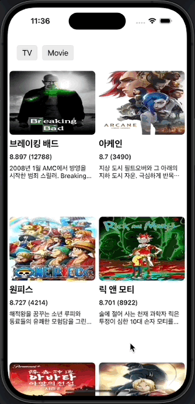
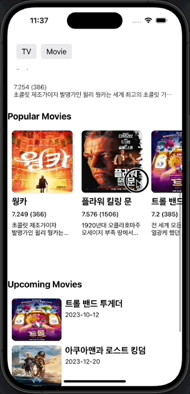
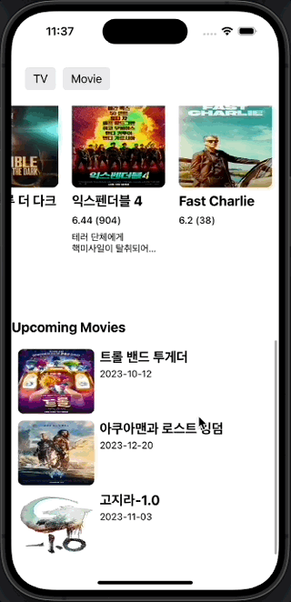

# UIKit TV & Movie Ranking App

### 🔢 목차
1. [개발 환경](#개발-환경)
2. [실행 화면](#실행-화면)
3. [참고 링크](#참고-링크)

---

### 🛠️ 개발 환경
|XCode Version|Deployment Target|
|:-:|:-:|
|15.0.1 (15C65)|iOS 17.0+|

|Framework|[UIKit](https://developer.apple.com/documentation/uikit)|[SnapKit](https://github.com/SnapKit/SnapKit/tree/main)|[RxSwift](https://github.com/ReactiveX/RxSwift/tree/main)|[Kingfisher](https://github.com/onevcat/Kingfisher/tree/master)|[RxAlamofire](https://github.com/RxSwiftCommunity/RxAlamofire/tree/main)|
|:-:|:-:|:-:|:-:|:-:|:-:|
|Version|-|5.6.0 <|main branch|master branch|main branch|

---

### 🎥 실행 화면
|TV 순위|영화 배너|
|:-:|:-:|
|||
|영화 순위|영화 개봉예정|
|||

---

### 🔗 참고 링크
- [ Developer Apple - Implementing Modern Collection Views](https://developer.apple.com/documentation/uikit/views_and_controls/collection_views/implementing_modern_collection_views)
- [ Developer Apple - NSCollectionViewCompositionalLayout](https://developer.apple.com/documentation/appkit/nscollectionviewcompositionallayout)
- [ Developer Apple - NSCollectionLayoutBoundarySupplementaryItem](https://developer.apple.com/documentation/uikit/nscollectionlayoutboundarysupplementaryitem)
- [ Developer Apple - UICollectionViewDiffableDataSource](https://developer.apple.com/documentation/uikit/uicollectionviewdiffabledatasource)
- [ Developer Apple - supplementaryViewProvider](https://developer.apple.com/documentation/uikit/uicollectionviewdiffabledatasource/3255142-supplementaryviewprovider)